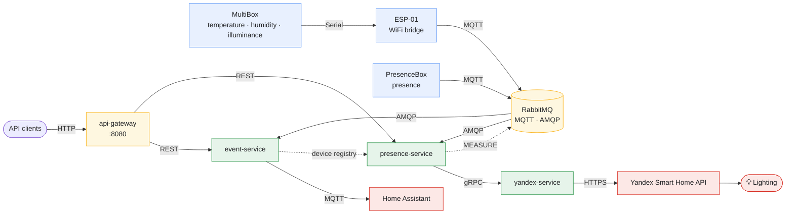

**English** · [Русский](README.md)

# Home Sweet Home

A distributed smart-home control system built on Arduino sensors, MQTT, and Spring Boot microservices. Collects room
telemetry (temperature, humidity, presence), persists it, forwards it to Home Assistant for dashboard visualization, and
automatically controls lighting via the Yandex Smart Home API.

## Architecture



Solid arrows are the data flow; dashed arrows are the control plane (device-registry replication and the `MEASURE` command).

Data flow:

1. **MultiBox** (Arduino Uno with temperature/humidity and illuminance sensors) sends readings over Serial to **ESP-01**, which
   publishes them to the broker over MQTT. **PresenceBox** (NodeMCU with a PIR sensor + microwave radar) publishes
   presence data directly to the broker over MQTT.
2. The broker — RabbitMQ with the MQTT plugin — accepts messages over MQTT and dispatches them to subscribers via AMQP
   queues.
3. **event-service** picks up all sensor events from the sensor AMQP queues, persists them to MongoDB, and forwards them
   to Home Assistant over MQTT — for dashboard visualization (temperature/humidity graphs, presence indicator,
   illuminance). It also owns the device registry — which device is in which room and of which type. **presence-service**
   receives presence and illuminance data from its own AMQP queues in parallel.
4. **presence-service** needs the device registry too — to pair a sensor with a lamp in the same room. Room and type
   changes are replicated from event-service to presence-service through a transactional outbox (messages over AMQP), so
   presence-service keeps a consistent copy and never queries event-service on the hot path.
5. **presence-service** controls the light only for sensors that share a room with a lamp: it turns the lamp on by
   presence when the room is dark, off when presence ends, and calls **yandex-service** over gRPC. When presence appears
   in such a room it also sends the climate sensor a `MEASURE` command (down-link over MQTT) to get fresh illuminance at
   once, without waiting for the next 60-second cycle.
6. **yandex-service** invokes the Yandex Smart Home API and toggles the lighting.

## Stack

**Backend**

- Java 21, Spring Boot 4.0
- Spring Data MongoDB (event-service)
- Spring AMQP (RabbitMQ) — inter-service bus
- Spring gRPC — synchronous calls between presence-service and yandex-service
- Spring Cloud Gateway (WebMVC) — API gateway, single entry point
- Spring Security (OAuth2 resource server, JWT) — authentication at the gateway
- Eclipse Paho — MQTT client
- Spring Boot Actuator + Micrometer — metrics (exported to Prometheus)

**Hardware / IoT**

- Arduino (Arduino Uno, ESP-01, NodeMCU)
- Sensors: DHT (temperature/humidity), PIR sensor + microwave radar (presence), LEDs

**Infrastructure**

- Docker / Docker Compose
- RabbitMQ, MongoDB
- Prometheus, Grafana — metrics and dashboards
- Loki, Vector — device and service logs
- GitLab CI/CD
- Home Assistant (external integration)

**Testing**

- JUnit 5, Mockito, AssertJ
- Testcontainers (MongoDB, RabbitMQ)

## Modules

| Module             | Purpose                                                               |
|--------------------|-----------------------------------------------------------------------|
| `event-service`    | Receives MQTT events, persists to MongoDB, forwards to Home Assistant |
| `presence-service` | Presence-based automation logic, gRPC client to yandex-service        |
| `yandex-service`   | gRPC server, proxy to the Yandex Smart Home API                       |
| `api-gateway`      | Single entry point: JWT authentication and routing of REST requests   |
| `grpc-api`         | Shared protobuf contracts                                             |
| `shared`           | Shared DTOs and parsers                                               |
| `arduino/`         | Firmware for `MultiBox`, `ESP-01` (WiFi bridge) and `PresenceBox`     |
| `docker/`          | docker-compose for spinning up the infrastructure                     |

## Hardware

PresenceBox pinout and other working notes — see [NOTES.en.md](NOTES.en.md).

## Running

Requirements: Java 21, Docker, Gradle, a Home Assistant account with the MQTT integration enabled.
Full checklist and CI/CD variables — see [NOTES.en.md](NOTES.en.md).

```bash
# spin up the infrastructure
docker compose -f docker/docker-compose.yml up -d
```

## Tests

See [docs/testing.en.md](docs/testing.en.md) for the autotest layout.

## Monitoring

Prometheus collects metrics from the services and RabbitMQ; Grafana renders the dashboards (both come up with the same
docker-compose). Grafana is at http://localhost:3000, Prometheus at http://localhost:9091. Vector collects device logs
and the services send their logs to Loki directly via logback; Loki stores everything — the logs are available in the
same Grafana. More detail (ports, dashboards, alert rules) — see [NOTES.en.md](NOTES.en.md).

## Roadmap

- **notification-service** — event notifications (Telegram bot: temperature alerts, presence alerts, service health).
- **Web UI** — a separate UI client over the services' REST endpoints. The API gateway (Spring Cloud Gateway) is
  already up as the single entry point on port 8080: it routes `/api/v1/**` to the services — sensor history and
  recording (`/api/v1/sensor-data`) and the device registry (`/api/v1/devices`) in event-service, light control
  (`/api/v1/lamp`) in presence-service.
- **voice-service** — custom voice control, without Yandex Alice.