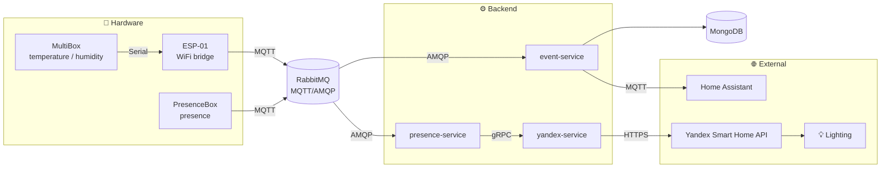

**English** · [Русский](README.md)

# Home Sweet Home

A distributed smart-home control system built on Arduino sensors, MQTT, and Spring Boot microservices. Collects room
telemetry (temperature, humidity, presence), persists it, forwards it to Home Assistant for dashboard visualization, and
automatically controls lighting via the Yandex Smart Home API.

## Architecture



Data flow:

1. **MultiBox** (Arduino Uno with a temperature/humidity sensor) sends readings over Serial to **ESP-01**, which
   publishes them to the broker over MQTT. **PresenceBox** (NodeMCU with a PIR sensor + microwave radar) publishes
   presence data directly to the broker over MQTT.
2. The broker — RabbitMQ with the MQTT plugin — accepts messages over MQTT and dispatches them to subscribers via AMQP
   queues.
3. **event-service** picks up all sensor events from the sensor AMQP queues, persists them to MongoDB, and forwards them
   to Home Assistant over MQTT — for dashboard visualization (temperature/humidity graphs, presence indicator, lamp
   state). **presence-service** receives PresenceBox data from its own AMQP queue in parallel.
4. **presence-service** decides whether to switch the light on/off and calls **yandex-service** over gRPC.
5. **yandex-service** invokes the Yandex Smart Home API and toggles the lighting.

## Stack

**Backend**

- Java 21, Spring Boot 4.0
- Spring Data MongoDB (event-service)
- Spring AMQP (RabbitMQ) — inter-service bus
- Spring gRPC — synchronous calls between presence-service and yandex-service
- Eclipse Paho — MQTT client
- Spring Boot Actuator + Micrometer — metrics (exported to Prometheus)

**Hardware / IoT**

- Arduino (Arduino Uno, ESP-01, NodeMCU)
- Sensors: DHT (temperature/humidity), PIR sensor + microwave radar (presence), LEDs

**Infrastructure**

- Docker / Docker Compose
- RabbitMQ, MongoDB
- Prometheus, Grafana — metrics and dashboards
- Loki, Vector — device and service logs
- GitLab CI/CD
- Home Assistant (external integration)

**Testing**

- JUnit 5, Mockito, AssertJ
- Testcontainers (MongoDB, RabbitMQ)

## Modules

| Module             | Purpose                                                               |
|--------------------|-----------------------------------------------------------------------|
| `event-service`    | Receives MQTT events, persists to MongoDB, forwards to Home Assistant |
| `presence-service` | Presence-based automation logic, gRPC client to yandex-service        |
| `yandex-service`   | gRPC server, proxy to the Yandex Smart Home API                       |
| `grpc-api`         | Shared protobuf contracts                                             |
| `shared`           | Shared DTOs and parsers                                               |
| `arduino/`         | Firmware for `MultiBox`, `ESP-01` (WiFi bridge) and `PresenceBox`     |
| `docker/`          | docker-compose for spinning up the infrastructure                     |

## Hardware

PresenceBox pinout and other working notes — see [NOTES.en.md](NOTES.en.md).

## Running

Requirements: Java 21, Docker, Gradle, a Home Assistant account with the MQTT integration enabled.
Full checklist and CI/CD variables — see [NOTES.en.md](NOTES.en.md).

```bash
# spin up the infrastructure
docker compose -f docker/docker-compose.yml up -d
```

## Tests

See [docs/testing.en.md](docs/testing.en.md) for the autotest layout.

## Monitoring

Prometheus collects metrics from the services and RabbitMQ; Grafana renders the dashboards (both come up with the same
docker-compose). Grafana is at http://localhost:3000, Prometheus at http://localhost:9091. Vector collects device logs
and the services send their logs to Loki directly via logback; Loki stores everything — the logs are available in the
same Grafana. More detail (ports, dashboards, alert rules) — see [NOTES.en.md](NOTES.en.md).

## Roadmap

- **notification-service** — event notifications (Telegram bot: temperature alerts, presence alerts, service health).
- **REST API** — control and data access: sensor history, manual light switching, current room state.
- **voice-service** — custom voice control, without Yandex Alice.
- **Light sensor** — wire up the luminance sensor already mounted in MultiBox.