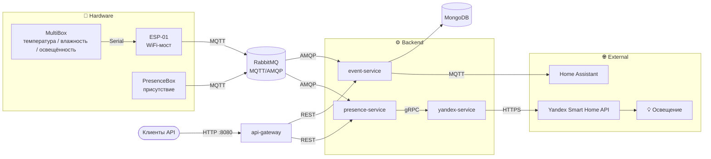

**Русский** · [English](README.en.md)

# Home Sweet Home

Распределённая система управления умным домом на базе Arduino-датчиков, MQTT и Spring Boot микросервисов. Собирает
телеметрию из комнаты (температура, влажность, присутствие), сохраняет её, передаёт в Home Assistant для визуализации на
дашборде и автоматически управляет освещением через Yandex Smart Home API.

## Архитектура



Поток данных:

1. **MultiBox** (Arduino Uno с датчиками температуры, влажности и освещённости) по serial передаёт показания на **ESP-01**, который
   публикует их в брокер по MQTT. **PresenceBox** (NodeMCU с PIR-датчиком + радаром) публикует данные о присутствии в
   брокер напрямую по MQTT.
2. Брокер — RabbitMQ с MQTT-плагином — принимает сообщения по MQTT и раздаёт их подписчикам через AMQP-очереди.
3. **event-service** забирает все сенсорные события из AMQP-очередей для датчиков, сохраняет в MongoDB и ретранслирует в
   Home Assistant по MQTT — для визуализации на дашборде (графики температуры/влажности, индикатор присутствия,
   освещённость). **presence-service** параллельно получает данные присутствия и освещённости из своих AMQP-очередей.
4. **presence-service** принимает решение о включении/выключении света по присутствию и освещённости (включает только в темноте, выключает при уходе) и вызывает **yandex-service** по gRPC.
5. **yandex-service** вызывает Yandex Smart Home API и переключает освещение.

## Стек

**Backend**

- Java 21, Spring Boot 4.0
- Spring Data MongoDB (event-service)
- Spring AMQP (RabbitMQ) — межсервисная шина
- Spring gRPC — синхронные вызовы между presence-service и yandex-service
- Spring Cloud Gateway (WebMVC) — API-шлюз, единая точка входа
- Eclipse Paho — MQTT-клиент
- Spring Boot Actuator + Micrometer — метрики (экспорт в Prometheus)

**Hardware / IoT**

- Arduino (Arduino Uno, ESP-01, NodeMCU)
- Датчики: DHT (температура/влажность), PIR-датчик + микроволновый радар (присутствие), светодиоды

**Инфраструктура**

- Docker / Docker Compose
- RabbitMQ, MongoDB
- Prometheus, Grafana — метрики и дашборды
- Loki, Vector — сбор логов устройств и сервисов
- GitLab CI/CD
- Home Assistant (внешняя интеграция)

**Тестирование**

- JUnit 5, Mockito, AssertJ
- Testcontainers (MongoDB, RabbitMQ)

## Модули

| Модуль             | Назначение                                                              |
|--------------------|-------------------------------------------------------------------------|
| `event-service`    | Приём MQTT-событий, сохранение в MongoDB, ретрансляция в Home Assistant |
| `presence-service` | Логика автоматизации по присутствию, gRPC-клиент к yandex-service       |
| `yandex-service`   | gRPC-сервер, прокси к Yandex Smart Home API                             |
| `api-gateway`      | Единая точка входа: маршрутизирует REST-запросы к сервисам              |
| `grpc-api`         | Общие protobuf-контракты                                                |
| `shared`           | Общие DTO и парсеры                                                     |
| `arduino/`         | Прошивки для `MultiBox`, `ESP-01` (WiFi-мост) и `PresenceBox`           |
| `docker/`          | docker-compose для запуска инфраструктуры                               |

## Hardware

Распиновка PresenceBox и прочие рабочие заметки — в [NOTES.md](NOTES.md).

## Запуск

Требования: Java 21, Docker, Gradle, аккаунт Home Assistant с MQTT-интеграцией.
Полный чек-лист и переменные CI/CD — в [NOTES.md](NOTES.md).

```bash
# поднять инфраструктуру
docker compose -f docker/docker-compose.yml up -d
```

## Тесты

Подробнее о структуре автотестов — в [docs/testing.md](docs/testing.md).

## Мониторинг

Метрики сервисов и RabbitMQ собирает Prometheus, дашборды — в Grafana (оба поднимаются тем же docker-compose). Grafana —
на http://localhost:3000, Prometheus — на http://localhost:9091. Логи устройств собирает Vector, а логи сервисов
отправляются в Loki напрямую через logback; хранит всё Loki — логи доступны в той же Grafana. Подробнее (порты,
дашборды, правила оповещений) — в [NOTES.md](NOTES.md).

## Планы

- **notification-service** — нотификации о событиях (Telegram-бот: алерты по температуре, тревоги по присутствию, статус
  сервисов).
- **Веб-интерфейс** — отдельный UI-клиент поверх REST-эндпоинтов сервисов. API-шлюз (Spring Cloud Gateway) уже поднят
  как единая точка входа на порту 8080: маршрутизирует `/api/v1/**` к сервисам — история и запись показаний
  (`/api/v1/sensor-data`) и реестр устройств (`/api/v1/devices`) в event-service, управление светом (`/api/v1/lamp`)
  в presence-service.
- **voice-service** — собственное голосовое управление, без интеграции с Алисой.
